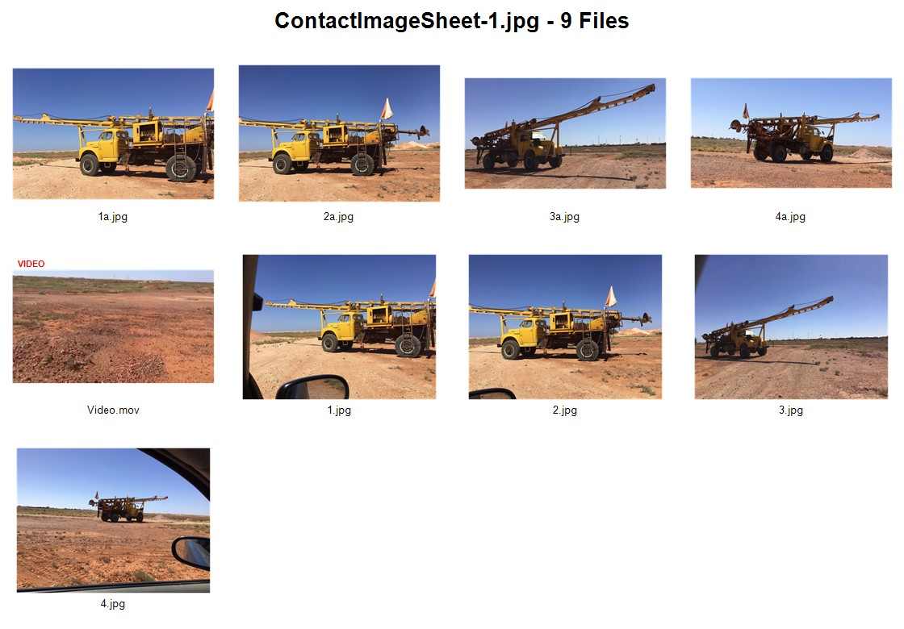

# MediaMosaic

Generate visual contact sheets from images and videos using PowerShell.

MediaMosaic recursively scans a folder, automatically corrects image orientation using EXIF metadata, extracts preview frames from video files, and generates one or more contact sheets containing thumbnails and filenames for every media file discovered.

Large collections are automatically split across multiple JPEG sheets (200 files per sheet by default), making MediaMosaic suitable for reviewing thousands of images and videos at a glance.

Originally developed to review large exploration and mining project folders containing thousands of photographs and videos, MediaMosaic provides a fast way to catalogue, audit, review, and prepare media collections for AI-assisted analysis.

---

## Features

* Recursive folder scanning
* Automatic EXIF image orientation correction
* Video thumbnail generation using FFmpeg
* Supports mixed image and video collections
* Thumbnail grid layout
* Filename captions beneath each thumbnail
* Red **VIDEO** overlay on video thumbnails
* Customisable thumbnail dimensions
* Customisable number of columns
* Automatic multi-sheet generation for large media collections
* Processes up to 200 files per contact sheet by default
* Automatically crops unused whitespace from output images
* High-resolution JPEG output
* Project title and file count displayed in output image
* Works with local folders, OneDrive folders, and SharePoint-synchronised libraries

---

## Supported Formats

### Images

* JPG
* JPEG
* PNG
* BMP
* GIF
* WEBP

### Videos

* MP4
* MOV
* AVI
* MKV

---

## Large Media Collections

MediaMosaic automatically splits large collections across multiple contact sheets.

By default:

```powershell
$FilesPerSheet = 200
```

If a folder contains more than 200 supported media files, additional sheets are created automatically:

```text
ProjectPhotos-1.jpg
ProjectPhotos-2.jpg
ProjectPhotos-3.jpg
ProjectPhotos-4.jpg
```

Examples:


* 87 files = 1 sheet
* 200 files = 1 sheet
* 201 files = 2 sheets
* 550 files = 3 sheets
* 1,000 files = 5 sheets

This prevents extremely large output images while maintaining readability and performance.

---

## Example Output



```text
ProjectPhotos-1.jpg - 200 Files

[thumbnail] [thumbnail] [thumbnail] [thumbnail]
IMG_001.jpg IMG_002.jpg VIDEO001.mp4 IMG_003.jpg

[thumbnail] [thumbnail] [thumbnail] [thumbnail]
IMG_004.jpg IMG_005.jpg VIDEO002.mov IMG_006.jpg
```

For large projects:

```text
ProjectPhotos-1.jpg
ProjectPhotos-2.jpg
ProjectPhotos-3.jpg
```

Each sheet contains up to 200 files.

---

## Requirements

### Windows

MediaMosaic has been tested on:

* Windows 10
* Windows 11
* PowerShell 5.1
* PowerShell 7+

### FFmpeg

Video thumbnail generation requires FFmpeg.

Download FFmpeg and update the path in the script:

```powershell
$FFmpeg = "C:\Tools\ffmpeg\ffmpeg.exe"
```

FFmpeg can be downloaded from:

https://ffmpeg.org/download.html

---

## Configuration

Update the settings section of the script:

```powershell
$RootFolder = "D:\Photos"
$OutputFile = "C:\Temp\MediaMosaic.jpg"

$FFmpeg = "C:\Tools\ffmpeg\ffmpeg.exe"

$FilesPerSheet = 200

$ThumbWidth = 250
$ThumbHeight = 180

$Columns = 4
```

### Settings

| Setting       | Description                            |
| ------------- | -------------------------------------- |
| RootFolder    | Folder to scan recursively             |
| OutputFile    | Base output filename                   |
| FFmpeg        | Path to FFmpeg executable              |
| FilesPerSheet | Maximum files per contact sheet        |
| ThumbWidth    | Thumbnail width                        |
| ThumbHeight   | Thumbnail height                       |
| Columns       | Number of thumbnails per row           |
| HeaderHeight  | Height of title area                   |
| Padding       | Spacing around thumbnails              |
| TextHeight    | Height allocated for filename captions |

---

## Usage

Run the script:

```powershell
.\MediaMosaic.ps1
```

Example output:

```text
Creating 2 sheet(s)...

Processing Sheet 1 of 2

Added: IMG_001.jpg
Added: IMG_002.jpg
Added: VIDEO001.mp4

Contact sheet created:

C:\Temp\ProjectPhotos-1.jpg

Processing Sheet 2 of 2

Added: IMG_201.jpg
Added: IMG_202.jpg

Contact sheet created:

C:\Temp\ProjectPhotos-2.jpg
```

---

## Common Use Cases

### Mining & Exploration

* Exploration project reviews
* Geological photography cataloguing
* Drill hole image indexing
* Field photography archives
* Opal mining documentation
* Exploration campaign reporting

### Project Management

* SharePoint media audits
* OneDrive media reviews
* Construction progress photography
* Asset management
* Site inspection records

### AI & Computer Vision

* Dataset review
* Image collection auditing
* Computer vision training preparation
* ChatGPT image review workflows
* Visual dataset indexing
* Quality assurance of training datasets

---

## How It Works

### Images

Image files are loaded directly and automatically rotated using embedded EXIF orientation metadata.

This ensures photographs taken on mobile phones and digital cameras are displayed correctly in the contact sheet.

### Videos

MediaMosaic uses FFmpeg to extract a preview frame approximately 3 seconds into each video.

Video thumbnails are automatically marked with a red:

```text
VIDEO
```

overlay for easy identification.

This allows video content to be reviewed without opening each file individually.

### Contact Sheets

Files are arranged into a thumbnail grid and saved as high-resolution JPEG images.

When more than the configured number of files are discovered, MediaMosaic automatically creates additional sheets.

Unused whitespace at the bottom of the final sheet is automatically removed before saving.

---

## Output Naming

If the output filename is configured as:

```powershell
$OutputFile = "C:\Temp\ProjectPhotos.jpg"
```

MediaMosaic will generate:

```text
ProjectPhotos-1.jpg
ProjectPhotos-2.jpg
ProjectPhotos-3.jpg
```

as required.

---

## License

MIT License

---

## Contributing

Pull requests, bug reports, and feature suggestions are welcome.

If you find MediaMosaic useful, consider starring the repository.
